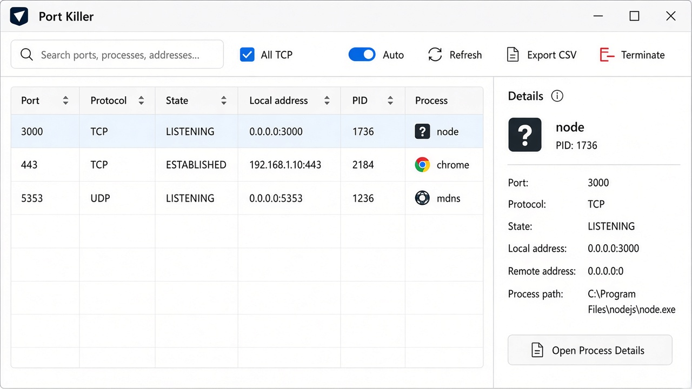

# Port Killer

[](https://github.com/Mryococo91/PortKiller/actions/workflows/ci.yml)
[](https://github.com/Mryococo91/PortKiller/releases/latest)
[](LICENSE)

Windows utility (WinUI 3) to see **which process is using which port**
and terminate it without `netstat` / `taskkill`.

Windows only. Free, open source (MIT). No account, no cloud, no telemetry.



The UI follows the Windows display language (English and French shipped).
Source code, comments, scripts, and documentation are in English.

## Downloads

Get the latest build from
[GitHub Releases](https://github.com/Mryococo91/PortKiller/releases/latest):

| File | Use |
| --- | --- |
| `PortKiller-<version>-win-x64.zip` | Portable — extract, run `PortKiller.exe` |
| `PortKiller-<version>-win-x64.msi` | Installer — Program Files, shortcuts, `Uninstaller.exe` |
| `PortKiller-<version>-win-x86.zip` / `.msi` | 32-bit Windows |
| `PortKiller-<version>-win-arm64.zip` | ARM64 portable |

Windows may show SmartScreen ("unknown publisher") because builds are
unsigned by default: **More info → Run anyway**. See [`docs/SIGNING.md`](docs/SIGNING.md).

Tagging `v*` on GitHub runs the [Release workflow](.github/workflows/release.yml)
which builds ZIP/MSI (multi-arch) and attaches them to the release.

## Features

- TCP / UDP, IPv4 + IPv6 via IP Helper (no shell)
- Search, column sort, CSV export (`Ctrl+E`)
- Process details pane, safe terminate with confirmation
- Auto-refresh, keyboard shortcuts, EN/FR UI
- Preferences persisted (filters, sort, column widths)
- Access Denied offers **Relaunch as administrator**

## Build prerequisites

- Windows 10 1809+ / Windows 11
- [.NET SDK 10](https://dotnet.microsoft.com/download)
- [Go](https://go.dev/dl/) — only to produce the portable ZIP (root launcher)

## Build for development

```powershell
dotnet build PortKiller.sln -p:Platform=x64
dotnet build PortKiller.sln -c Release -p:Platform=x64
dotnet test tests/PortKiller.Tests/PortKiller.Tests.csproj -c Release
.\scripts\run-smoke-checks.ps1
```

Open `PortKiller.sln` in Visual Studio. Profiles:

- `PortKiller (Unpackaged)` — exe without installation
- `PortKiller (Package)` — debug MSIX

Version number lives in `Directory.Build.props` (`<Version>`). Publish scripts
read it automatically for ZIP/MSI file names.

## Distribute locally

```powershell
.\scripts\publish-portable.ps1          # ZIP for current -Runtime (default win-x64)
.\scripts\publish-msi.ps1               # MSI (+ portable) for win-x64
.\scripts\run-smoke-checks.ps1 -Publish # build, test, publish, verify Uninstaller.exe
```

Optional signing after publish:

```powershell
$env:SIGNING_PFX_PATH = "C:\certs\portkiller.pfx"
$env:SIGNING_PFX_PASSWORD = "***"
.\scripts\sign-artifacts.ps1 -Paths @(
  ".\artifacts\portable\win-x64\PortKiller.exe",
  ".\artifacts\msi\PortKiller-1.2.0-win-x64.msi"
)
```

For CI signing, add repository secrets `SIGNING_PFX_BASE64` and
`SIGNING_PFX_PASSWORD` (see `docs/SIGNING.md`).

### Equivalent portable command

```powershell
dotnet publish .\PortKiller.csproj `
  -c Release `
  -r win-x64 `
  --self-contained true `
  -p:Platform=x64 `
  -p:PublishProfile=portable-win-x64 `
  -p:WindowsPackageType=None `
  -p:WindowsAppSDKSelfContained=true `
  -p:SelfContained=true `
  -p:PublishSingleFile=false `
  -p:PublishTrimmed=false `
  -o .\artifacts\portable\win-x64
```

## MSIX (optional, not recommended for GitHub)

MSIX sideload requires installing a certificate and enabling developer /
sideload mode. Poor fit for a public download.

```powershell
.\scripts\publish-msix.ps1
```

## Localization

The UI uses WinUI `.resw` resources and follows the Windows display language.
English (`en-US`) is the default fallback. French (`fr-FR`) is included.
Users can override the language in the app; the choice is stored with the
other preferences in `%LocalAppData%\PortKiller\settings.json`
(a legacy `language.txt` is migrated automatically).

To add a language:

1. Copy `Strings/en-US/Resources.resw` to `Strings/<culture>/Resources.resw`.
2. Translate the values.
3. Register the culture in `Helpers/LocalizationService.cs`.

## Repository layout

See `docs/ARCHITECTURE.md`, `docs/PLAN.md`, `docs/STATUS.md`,
`docs/SMOKE_TEST.md`, and `docs/SIGNING.md`.

```text
PortKiller.sln
src/PortKiller.Core/     Shared models + filter + termination
tests/PortKiller.Tests/  Unit tests (no WinUI)
.github/workflows/       CI + tag release
scripts/                 publish, sign, smoke checks
```
